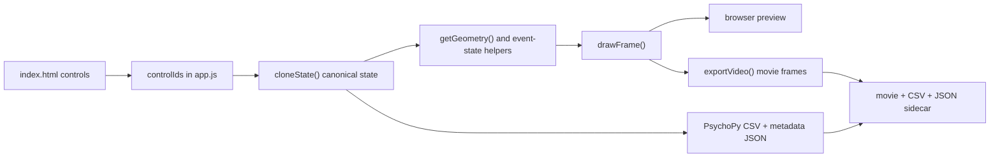
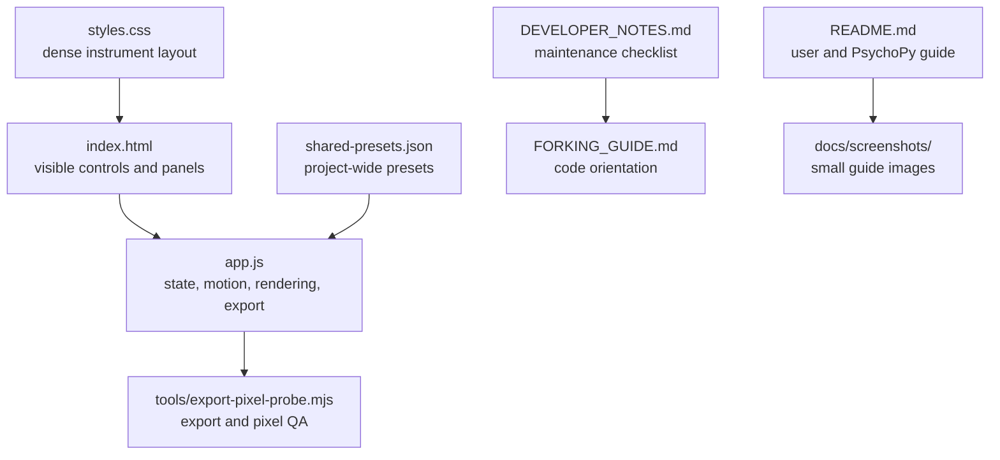
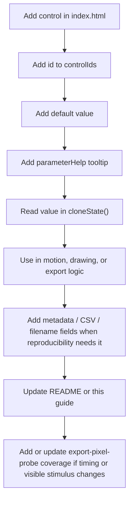
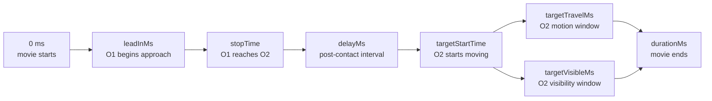
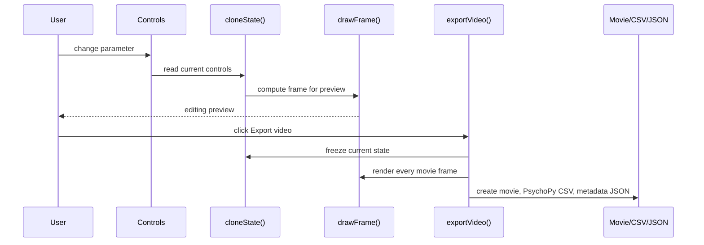
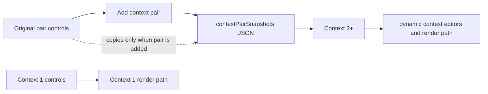
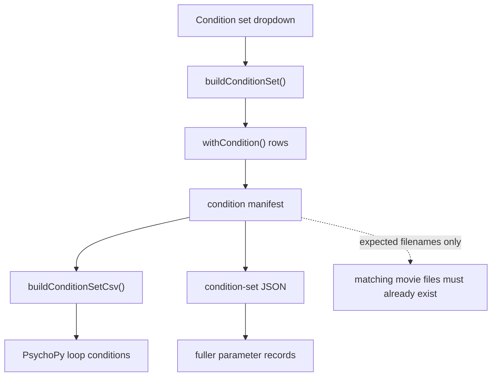

# Forking Guide for Lab Researchers

This guide is for researchers who want to adapt Launching Video Maker for a new causal-perception study without rebuilding the app. The code is a static browser app: there is no bundler, framework, or server-side runtime.

## Big Picture

The app has one core pipeline. A user changes controls, the app reads those controls into one state object, the motion helpers compute object positions, and the same renderer draws preview frames and exported movie frames.



The exported video is the timing reference. The preview is an editing aid. Any fork that changes participant-visible motion, timing, color, sound, or cues must keep the exported video, CSV, and JSON sidecar consistent.

## Repository Map



Start in `app.js` only after checking whether the change also needs a control in `index.html`, layout work in `styles.css`, documentation in `README.md`, and a new pixel check in `tools/export-pixel-probe.mjs`.

## Most Important Code Paths

- `controlIds` tells the app which HTML controls exist. If an adjustable control is missing here, it usually will not enter the state, export metadata, or preset system.
- `stimulusDefaults` and `presentationDefaults` define the reset state and the base for presets.
- `cloneState()` is the canonical state read by preview, export, CSV, JSON, and condition sets.
- `getGeometry()`, `getMainEventState()`, `getDirectedEventState()`, and Billiard helpers turn parameters into positions and collision timing.
- `drawFrame()` is the rendering entry point for both preview and export.
- `exportVideo()`, `buildPsychopyCsv()`, and `buildPsychopyMetadata()` produce the lab artifacts.
- `buildConditionSet()` and related CSV helpers create experiment plans. They do not render every planned movie.
- `tools/export-pixel-probe.mjs` is the repeatable check for contact, visibility, Billiard, sound scheduling, and exported-frame behavior.

## Adding One Parameter

Use this path when adding a parameter such as a new cue strength, timing value, or context setting.



Do not treat a visible parameter as finished until a saved movie and its sidecar records agree about the value.

## Timing Vocabulary

Most timing bugs come from mixing event time, video time, and visibility time.



Key terms:

- `leadInMs`: still time before O1 moves.
- `stopTime`: the computed contact time for O1 and O2.
- `delayMs`: time between contact and O2 motion.
- `targetStartTime`: contact time plus delay.
- `targetTravelMs`: how long O2 keeps moving after it starts.
- `targetVisibleMs`: how long O2 stays visible after it starts. O2 remains visible before contact.
- `contextOffsetMs`: shifts the context event relative to the original pair.

If a fork changes one of these values, check both preview and exported frames. The exported frames are the reference.

## Preview and Export Flow



If preview and export disagree, the exported movie wins for experiments, but the disagreement should still be fixed or documented.

## Context Pair State

Context state has one special rule: Context 1 uses normal controls, while Context 2 and later use stored snapshots. This lets added pairs copy the original pair at creation time without being overwritten by later edits to the original pair.



When a fork changes context motion, test Context 1 and Context 2+ separately. They do not share the same storage path.

## Condition Set Flow

Condition sets are experiment plans. They create expected filenames and PsychoPy rows; they do not render every planned movie.



Use this path when a lab wants a grid such as delay by overlap, capture context duration, or adaptation/test families. Add the condition family, then check that every row carries the same parameter names used by single-video CSV and metadata export.

## Common Fork Tasks

| Goal | First files to inspect | Usual risk |
| --- | --- | --- |
| Add a new visual cue | `index.html`, `app.js`, `README.md` | Cue appears in preview but not export, or export metadata omits it. |
| Add a new motion parameter | `app.js`, `tools/export-pixel-probe.mjs` | Timing changes without a pixel-level export check. |
| Change context behavior | `app.js` context snapshot helpers | Context 1 works, Context 2+ uses stale snapshot logic. |
| Change export behavior | `app.js`, `README.md` | Movie, CSV, and JSON disagree. |
| Add a condition family | `index.html`, `app.js`, `README.md` | Condition rows imply movies that have not been rendered. |
| Add shared presets | `shared-presets.json`, `README.md` | Presets omit a new parameter or depend on local browser storage. |
| Change layout density | `styles.css`, `index.html` | Controls fit desktop but break on narrow screens. |

## Checks Before Sharing a Fork

Run:

```bash
node --check app.js
node --check tools/export-pixel-probe.mjs
node tools/export-pixel-probe.mjs
git diff --check
```

Then test in the browser:

1. Load the app from the local server.
2. Change one movement parameter and one position parameter.
3. Add at least two context pairs.
4. Play the preview.
5. Export a video.
6. Confirm the movie, PsychoPy CSV, and metadata JSON all reflect the same settings.
