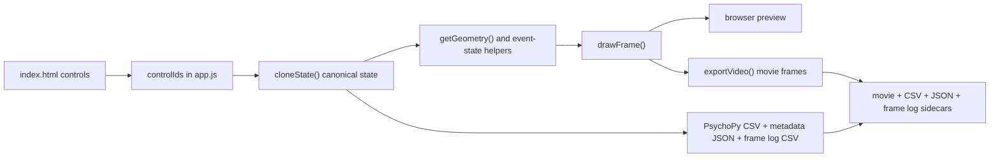
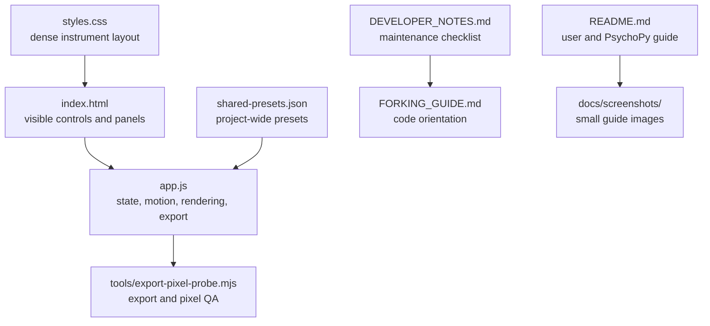
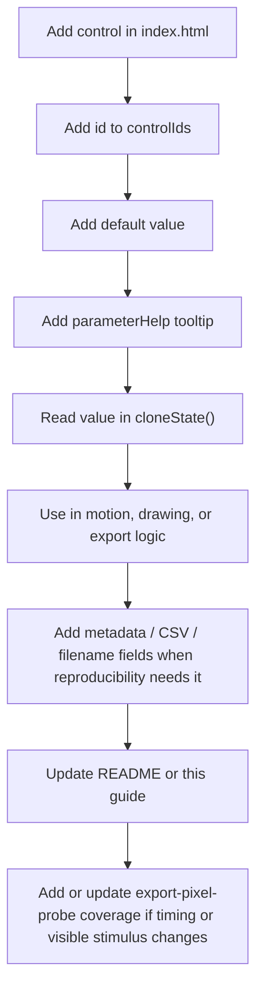
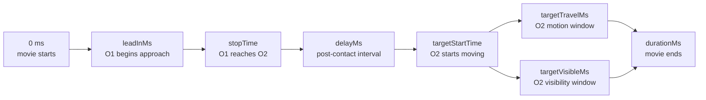
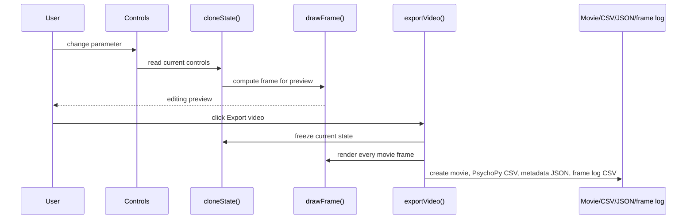
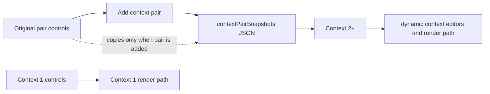
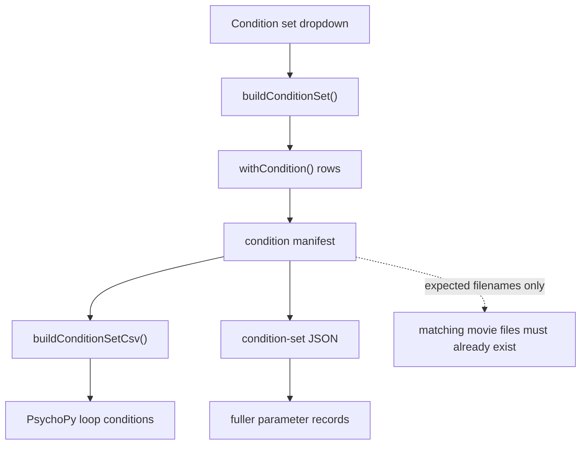

# Forking Guide for Lab Researchers

This guide is for researchers who want to adapt Launching Video Maker for a new causal-perception study without rebuilding the app. The code is a static browser app: there is no bundler, framework, or server-side runtime.

## Big Picture

The app has one core pipeline. A user changes controls, the app reads those controls into one state object, the motion helpers compute object positions, and the same renderer draws preview frames and exported movie frames.



The exported video is the timing reference. The preview is an editing aid. Any fork that changes participant-visible motion, timing, color, sound, or cues must keep the exported video, PsychoPy CSV, metadata JSON, and frame log CSV consistent.

## Why This App Is Forkable

The app is deliberately ordinary web technology. A fork does not need to understand a framework, a build system, a backend service, or a deployment pipeline before making a useful change.

- It is static: GitHub Pages can serve it directly.
- It has one main script: `app.js` is large, but it keeps the control, state, motion, drawing, and export contracts in one searchable place.
- It has one canonical state path: `cloneState()` is the object that preview, export, metadata, PsychoPy CSV, presets, and condition sets read from.
- It has one drawing path: `drawFrame()` is used by both the preview and exported movie frames, so a visible cue should not accidentally exist only in the editor.
- It has explicit sidecar records: CSV, JSON, and frame-log exports are meant to make stimulus settings inspectable after the movie is generated.
- It has a repeatable export probe: `tools/export-pixel-probe.mjs` exports real videos in Chrome and checks decoded frames, which catches bugs that DOM-only tests miss.

The tradeoff is that a new experimental parameter must be wired through several places. That is intentional. It makes the parameter visible to users, reproducible in exported records, and testable after export.

## Repository Map



Start in `app.js` only after checking whether the change also needs a control in `index.html`, layout work in `styles.css`, documentation in `README.md`, and a new pixel check in `tools/export-pixel-probe.mjs`.

## Most Important Code Paths

- `controlIds` tells the app which HTML controls exist. If an adjustable control is missing here, it usually will not enter the state, export metadata, or preset system.
- `stimulusDefaults` and `presentationDefaults` define the reset state and the base for presets.
- `cloneState()` is the canonical state read by preview, export, CSV, JSON, and condition sets.
- `getGeometry()`, `getMainEventState()`, `getDirectedEventState()`, and Billiard helpers turn parameters into positions and collision timing.
- `drawFrame()` is the rendering entry point for both preview and export.
- `exportVideo()`, `buildPsychopyCsv()`, `buildPsychopyMetadata()`, and `buildFrameLogCsv()` produce the lab artifacts.
- `buildConditionSet()` and related CSV helpers create experiment plans. They do not render every planned movie.
- `tools/export-pixel-probe.mjs` is the repeatable check for contact, visibility, Billiard, sound scheduling, and exported-frame behavior.

## How To Read `app.js`

Read the file by contracts, not by line count.

1. Start with the maintainer map at the top of `app.js`.
2. Find the relevant control id in `controlIds`.
3. Check its default in `stimulusDefaults` or `presentationDefaults`.
4. Check its tooltip in `parameterHelp`; that usually states the intended user-facing meaning.
5. Check `cloneState()` to see the stored type and field name.
6. Search for that field name in motion, rendering, export, metadata, and condition-set helpers.
7. Only then edit behavior.

This order prevents the most common fork failure: changing what a control does on screen without changing the exported records, or changing exported records without changing the UI.

## State Contracts

| Contract | Where it lives | What it means | Forking risk |
| --- | --- | --- | --- |
| Control ids | `index.html`, `controlIds` | Adjustable user inputs that the app knows how to read. | A visible control not in `controlIds` is usually inert or missing from records. |
| Stimulus defaults | `stimulusDefaults` | Motion, geometry, cues, color, and other stimulus parameters. | Presets and reset behavior can silently omit new stimulus fields. |
| Presentation defaults | `presentationDefaults` | Export, display, PsychoPy, and editor-related defaults. | Metadata can drift from what the lab thinks it exported. |
| Canonical state | `cloneState()` | The one object used by preview, export, records, and condition sets. | Type mismatches here spread everywhere. |
| Context snapshots | `contextPairSnapshots` | Stored JSON for Context 2+ after a pair is created. | Context 1 can work while Context 2+ stays stale. |
| Trajectory overrides | `trajectoryOverrides` | Stored JSON mapping selected object ids to angle offsets. | Individual trajectory edits can appear in preview but be absent from export records if not wired through state. |
| Clip sequence | `sequenceClips` in `app.js` | In-memory list of full clip states for composed exports. | Export can accidentally render only the selected clip if plan helpers are bypassed. |
| Sidecar records | CSV, JSON, frame log | The durable evidence for generated stimuli. | A movie without sidecars is hard to audit or reproduce. |

## Control Ownership

Keep controls near the conceptual feature they change.

| Section | Owns | Does not own |
| --- | --- | --- |
| Starting Position and Movement | Radius, overlap/gap, tunnels, manual start points, trajectory vectors, lead-in, speed, acceleration, delay, O2 angle, travel time, visibility timing, and after-contact behavior. | Hidden whole-stimulus x/y offsets; keep those internal unless a specific experiment needs them exposed. |
| Context | Number of added pairs, context timing, context direction, and copied context-pair state. | Global export behavior. |
| Special features | Participant-visible cues such as grouping, marker, contact guide, fracture, Billiard, crosshair, blink, rail, text, and sound. | Ordinary motion parameters that define the base launch. |
| PsychoPy / Export | File format, FPS, aspect ratio, bitrate, Add clip, CSV, JSON, frame log, and condition sets. | Participant-visible stimulus design. |

If a control feels awkward in the UI, move it to the section that owns its experimental meaning before adding styling around it.

## Adding One Parameter

Use this path when adding a parameter such as a new cue strength, timing value, or context setting.



Do not treat a visible parameter as finished until a saved movie and its sidecar records agree about the value.

## Change Safety Rules

- Preserve old field names in exported CSV and JSON unless there is a migration reason to break them.
- Do not remove hidden compatibility controls merely because they are not shown in the UI; check whether presets, metadata, or condition rows still read them.
- If a feature changes what participants can see or hear, update `README.md`.
- If a feature changes the internal pipeline, update this guide.
- If a feature changes a maintenance checklist, update `DEVELOPER_NOTES.md`.
- If a feature changes exported timing, visibility, contact geometry, Billiard behavior, sound scheduling, or frame logging, update or rerun `tools/export-pixel-probe.mjs`.
- If a feature changes context behavior, test Context 1 and Context 2+ separately.
- If a feature changes clip sequencing, test current-clip preview, sequence preview, returning to Clip 1, full-sequence export, metadata JSON, and frame-log CSV.

## Timing Vocabulary

Most timing bugs come from mixing event time, video time, and visibility time.



Key terms:

- `leadInMs`: still time before O1 moves.
- `stopTime`: the computed contact time for O1 and O2.
- `delayMs`: time between contact and O2 motion.
- `targetStartTime`: contact time plus delay.
- `targetTravelMs`: how long O2 keeps moving after it starts.
- `targetVisibleMs`: how long O2 stays visible after it starts. O2 remains visible before contact.
- `contextOffsetMs`: shifts the context event relative to the original pair.

If a fork changes one of these values, check both preview and exported frames. The exported frames are the reference.

## Preview and Export Flow



If preview and export disagree, the exported movie wins for experiments, but the disagreement should still be fixed or documented.

## Context Pair State

Context state has one special rule: Context 1 uses normal controls, while Context 2 and later use stored snapshots. This lets added pairs copy the original pair at creation time without being overwritten by later edits to the original pair.



When a fork changes context motion, test Context 1 and Context 2+ separately. They do not share the same storage path.

## Condition Set Flow

Condition sets are experiment plans. They create expected filenames and PsychoPy rows; they do not render every planned movie.



Use this path when a lab wants a grid such as delay by overlap, capture context duration, or adaptation/test families. Add the condition family, then check that every row carries the same parameter names used by single-video CSV and metadata export.

## Common Fork Tasks

| Goal | First files to inspect | Usual risk |
| --- | --- | --- |
| Add a new visual cue | `index.html`, `app.js`, `README.md` | Cue appears in preview but not export, or export metadata omits it. |
| Add a new motion parameter | `app.js`, `tools/export-pixel-probe.mjs` | Timing changes without a pixel-level export check. |
| Change context behavior | `app.js` context snapshot helpers | Context 1 works, Context 2+ uses stale snapshot logic. |
| Change export behavior | `app.js`, `README.md` | Movie, CSV, JSON, and frame log disagree. |
| Add a condition family | `index.html`, `app.js`, `README.md` | Condition rows imply movies that have not been rendered. |
| Add shared presets | `shared-presets.json`, `README.md` | Presets omit a new parameter or depend on local browser storage. |
| Change layout density | `styles.css`, `index.html` | Controls fit desktop but break on narrow screens. |
| Move a control to a better section | `index.html`, `styles.css`, `README.md` | The visible UI improves, but docs still describe the old ownership. |
| Expose a formerly hidden field | `index.html`, `app.js`, sidecar records | A technical helper becomes a user-facing experimental parameter without enough explanation. |
| Tune Billiard realism | `app.js`, `tools/export-pixel-probe.mjs`, `README.md` | Synthetic scatter makes a clean head-on hit look like a trick shot. |

## Documentation Maintenance

Documentation is part of the app's reliability story. A fork should be able to answer three questions quickly:

1. What does this control mean experimentally?
2. Where does that value enter the state, rendering, export, and records?
3. How do I check that a generated movie really matches the intended condition?

Use this update rule:

- User-facing workflow change: update `README.md`.
- Internal pipeline or control ownership change: update `FORKING_GUIDE.md`.
- Maintenance checklist or code-path convention change: update `DEVELOPER_NOTES.md`.
- Visual explanation needed: update or add a small file in `docs/screenshots/`.

Examples:

- Combining manual start-point and trajectory editing requires README and this guide to describe one visible editing switch while preserving both state fields.
- Hiding x/y offsets while keeping the hidden fields requires this guide to say that whole-stimulus offsets are internal unless a specific experiment needs them exposed.
- Adding a new output artifact requires README, developer notes, and the forking guide to say when to use it and how it relates to the movie.

## Checks Before Sharing a Fork

Run:

```bash
node --check app.js
node --check tools/export-pixel-probe.mjs
node tools/export-pixel-probe.mjs
git diff --check
```

Then test in the browser:

1. Load the app from the local server.
2. Change one movement parameter and one position parameter.
3. Add at least two context pairs.
4. Play the preview.
5. Export a video.
6. Confirm the movie, PsychoPy CSV, metadata JSON, and frame log CSV all reflect the same settings.
7. Read `README.md`, `DEVELOPER_NOTES.md`, and this guide as if you were a new lab member; update any section that describes the old behavior.
