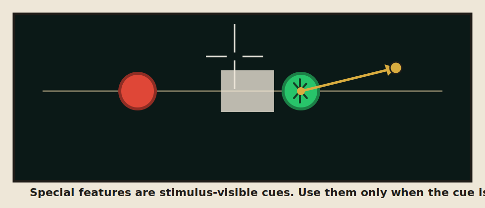
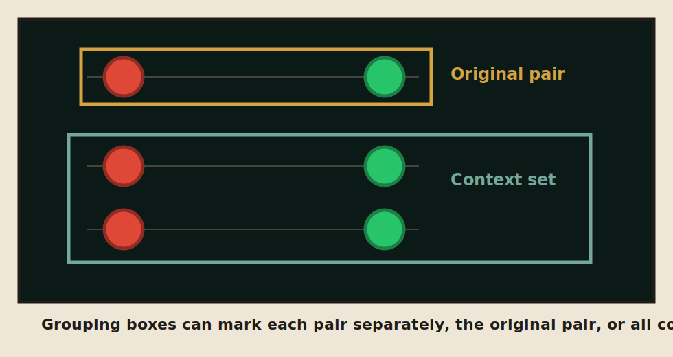
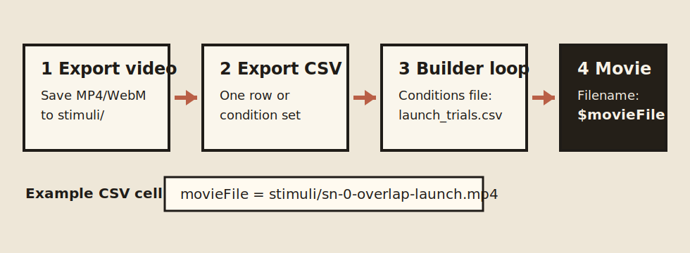

# Launching Video Maker

[Open Launching Video Maker](https://apronnet.github.io/Causal-Perception/)

No installation is needed. The app runs in the browser and exports participant-ready launching videos for causal perception experiments.

The default case is the canonical Michotte launch: O1 contacts O2 with no gap, O1 stops, and O2 immediately moves in the same direction at matched speed. Added context pairs copy that same clear-launch relation when they are created.

## Basic Workflow

1. Choose a preset, usually **Clear launch (0% overlap)**.
2. Adjust the core event: movement, position, color, background, and optional context pairs.
3. Use **Play preview** for editing only.
4. Use **Export video** for the stimulus file shown to participants.
5. Use **Export PsychoPy CSV** or **Condition set** if the video will be used in PsychoPy.

The exported video is the timing reference. The browser preview is useful for editing, but final FPS, sound, aspect ratio, and resolution should be checked from the exported file.

## Browser Compatibility

The maker is browser-only and should open directly on Windows, macOS, Android, and iOS. Preview, presets, CSV, and JSON use standard web features. Video export depends on the browser's built-in canvas recording and media encoder support.

If a phone or tablet has trouble exporting a movie, try a lower resolution first. If MP4 is unavailable, the app falls back toward WebM when the browser allows it. If the file opens instead of saving, use the browser's Save or Share option.

## Core Controls

**Movement** controls when and how the two objects move. Important settings are lead-in, O1 speed, O1 acceleration, O2 delay, O2 speed ratio, O2 acceleration, O2 angle, and what O1 does after contact.

**Position** controls contact geometry. `Overlap / gap = 0 px` means the borders just touch. Positive values leave a gap. Negative values overlap. Tunnel occluders can hide the contact region.

**Context** adds extra object pairs. New context pairs copy the original pair when they are added; later changes to the original pair do not automatically change those copied pairs.

**Color** controls the ball colors and sudden color-change cue.

**Background** controls the stimulus field. Dark background with red/green discs is the safest default for the classic displays.

## Special Features

Special features are visible or audible stimulus cues. Use them only when the cue is part of the experimental condition.



- **Crosshair** adds a draggable fixation-like crosshair to the stimulus.
- **Blink before launch** shows only the crosshair before the balls appear. When enabled, the app resets the post-blink event to a classic launch and sets video duration to `blink time + 1200 ms`.
- **Rail** adds one or more draggable line segments. Use this for alignment or path-cue manipulations.
- **Individual trajectories** shows draggable vector arrows in the preview. Drag the arrow head to set that ball's trajectory. The angle slider remains available for exact entry.
- **Fracture** adds edge-reaching cracks after impact. When context pairs are present, Special features lets you choose O1 or O2 separately for each pair.
- **Physics mode** uses ball size to estimate mass and solve a simple collision. Larger balls are treated as heavier. The mode resets delay, gaps, tunnels, markers, sudden color change, and manual trajectories because those features break the physical-collision assumption.
- **Impact sound** adds a contact sound. If sound is not a condition, leave it off.

## Perceptual Grouping

Perceptual grouping is in **Special features** because the boxes are visible cues. The grouping toggle automatically boxes the original pair and Context 1 when context is shown. If you need a custom region, click **Add rectangle** and drag its border or corners in the preview.



Use grouping when the experiment asks whether a visible grouping cue changes the causal impression. Do not use it for clean Michotte-style launch displays unless grouping itself is part of the manipulation.

## PsychoPy



### One Video

Use this when one exported movie is one stimulus condition.

1. Click **Export video**.
2. Put the movie in your PsychoPy project, usually in `stimuli/`.
3. Click **Export PsychoPy CSV**.
4. Put the CSV in your PsychoPy project, for example `conditions/launch_trials.csv`.
5. In Builder, add a Loop around the movie routine and set the loop conditions file to that CSV.
6. In the Movie component, set the filename field to `$movieFile`.

Example project layout:

```text
my_experiment/
  my_experiment.psyexp
  conditions/
    launch_trials.csv
  stimuli/
    sn-0-overlap-launch-v876pxs-delay0ms-contact-ratio100pct.mp4
```

Example CSV idea:

```csv
movieFile,conditionLabel,intendedDurationSec,forceEndRoutine
stimuli/sn-0-overlap-launch-v876pxs-delay0ms-contact-ratio100pct.mp4,clear_launch,1.8,true
```

In Builder, use:

```text
Movie filename: $movieFile
```

### Condition Set

**Condition set** is not a stimulus-display parameter. It makes a batch plan for an experiment.

Use it when you want many planned trials, such as **Delay x overlap grid** or **Capture: context duration**. Click **Set CSV** to export a PsychoPy-ready table where each row is one planned condition.

Important points:

- **Export video** exports only the one video currently shown in the preview.
- **Export PsychoPy CSV** exports a one-row PsychoPy table for the current single video.
- **Condition set + Set CSV** exports a multi-row experiment plan.
- **Set JSON** exports the same condition set with fuller parameter records.
- Condition sets do not automatically render every video in the set. They create expected filenames and parameter rows; you still need matching movie files for those rows.

## Reproducibility

The app cannot reliably embed all custom parameter metadata inside MP4/WebM files because browser encoders do not expose stable metadata-writing controls. Use the exported CSV and JSON sidecar as the durable parameter record.

If you publish stimuli, keep the movie, PsychoPy CSV, and metadata JSON together.

## Maintainer Note

When a new feature is implemented, update this README at the same time. Add a small guide image when the feature is easier to understand visually.
