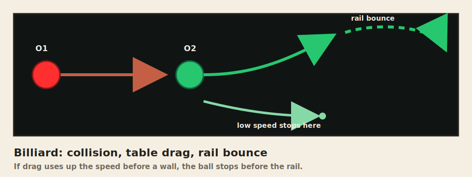

# Launching Video Maker

[Open Launching Video Maker](https://apronnet.github.io/Causal-Perception/)

No installation is needed. The app runs in the browser and exports participant-ready launching videos for causal perception experiments.

This is a tool made by Runkun with brilliant help from Codex 5.5, for a project on causal perception by the lab at UIUC under the direction of Dr. Livengood, Dr. Heaton, and Dr. Hummel. You are welcome to repurpose the code for your own lab projects; simple credit is fine.

## Basic Workflow

1. Choose a preset, usually **Clear launch (0% overlap)**.
2. Adjust the core event: movement, position, color, background, and optional context pairs.
3. Use **Play preview** for editing only.
4. Use **Export video** for the stimulus file shown to participants.
5. Use **Export PsychoPy CSV** or **Condition set** if the video will be used in PsychoPy.
6. Use **Export frame log CSV** when you need frame-by-frame object coordinates for checking a stimulus.

The exported video is the timing reference. The browser preview is useful for editing, but final FPS, sound, aspect ratio, and resolution should be checked from the exported file.

The app shows stimulus checks only when a parameter combination is likely to need review, for example large overlaps, contact outside the clip, or O2 disappearing while it is still supposed to travel.

## Browser Compatibility

The maker is browser-only and should open directly on Windows, macOS, Android, and iOS. Preview, presets, CSV, and JSON use standard web features. Video export depends on the browser's built-in canvas recording and media encoder support.

If a phone or tablet has trouble exporting a movie, try a lower resolution first. If MP4 is unavailable, the app falls back toward WebM when the browser allows it. If the file opens instead of saving, use the browser's Save or Share option.

## Core Controls

**Starting Position and Movement** controls where the objects begin and how they move. Important settings are radius, after-contact behavior, tunnel occluders, lead-in, O1 speed, O1 acceleration, O2 delay, O2 speed ratio, O2 acceleration, O2 angle, travel time after collision, visibility timing, and contact spacing. Travel time controls how long O2 keeps moving after contact; O2 on-screen time controls when O2 disappears. `Contact spacing = 0 px` means the borders just touch. Positive values leave a gap. Negative values overlap.

**Manually adjust starting positions and trajectories** shows editable start-point handles and trajectory vectors in the preview.

**Context** adds extra object pairs. New context pairs copy the original pair when they are added; later changes to the original pair do not automatically change those copied pairs.

**Compose a sequence** starts a sequence. The first click stores the current settings as Clip 1 and opens Clip 2 as a copy. The clip strip below the preview lets you return to any earlier clip and keep editing it. **Current clip** previews only the selected clip; **Sequence** previews the full composition. When a sequence has two or more clips, **Export video** exports the full sequence as one movie.

**Color and Background** controls the stimulus field, object colors, disc style, and sudden color-change cue. Dark background with red/green discs is the safest default for the classic displays.

## Special Features

Special features are visible or audible stimulus cues. Use them only when the cue is part of the experimental condition.




- **Crosshair** adds a movable fixation-like crosshair to the stimulus.
- **Blink before launch** shows only the crosshair before the balls appear. The crosshair disappears after the blink by default; use **After blink: Stay** if it should remain during the launch. When enabled, the app resets the post-blink event to a classic launch and sets video duration to `blink time + 1200 ms`.
- **Rail** adds one or more movable line segments. Use this for alignment or path-cue manipulations.
- **Fracture** adds edge-reaching cracks after impact. When context pairs are present, Special features lets you choose O1 or O2 separately for each pair.
- **Billiard** is experimental. It may break or produce unstable motion, so check exported videos before using it in a study. It uses ball size to estimate mass and solves a simple collision. Realism is on by default: clean head-on hits stay straight, with a faster break-like launch, visible table slowdown, cushion rebound, and real recollisions. Turn Realism off to edit manual friction and bounce values. With context pairs, each row acts as its own table lane so balls do not cross through other rows. Billiard turns off delay, gaps, tunnels, markers, sudden color change, and manual trajectories.
- **Impact sound** adds a short cue at each visible collision event, including context-pair collisions. If sound is not a condition, leave it off.

## Perceptual Grouping

Perceptual grouping is in **Special features** because the boxes are visible cues. The grouping toggle automatically boxes the original pair and Context 1 when context is shown. If you need a custom region, click **Add rectangle** and move its border or resize from a corner in the preview.


Use grouping when the experiment asks whether a visible grouping cue changes the causal impression. Do not use it for clean Michotte-style launch displays unless grouping itself is part of the manipulation.

## PsychoPy


### One Video

Use this when one exported movie is one stimulus condition.

1. Click **Export video**.
2. Put the movie in your PsychoPy project, usually in `stimuli/`.
3. Click **Export PsychoPy CSV**.
4. Put the CSV in your PsychoPy project, for example `conditions/launch_trials.csv`.
5. In Builder, add a Loop around the movie routine and set the loop conditions file to that CSV.
6. In the Movie component, set the filename field to `$movieFile`.

Example project layout:

```text
my_experiment/
  my_experiment.psyexp
  conditions/
    launch_trials.csv
  stimuli/
    sn-0-overlap-launch-v876pxs-delay0ms-contact-ratio29pct.mp4
```

Example CSV idea:

```csv
movieFile,conditionLabel,intendedDurationSec,forceEndRoutine
stimuli/sn-0-overlap-launch-v876pxs-delay0ms-contact-ratio29pct.mp4,clear_launch,1.8,true
```

In Builder, use:

```text
Movie filename: $movieFile
```

### Condition Set

**Condition set** is not a stimulus-display parameter. It makes a batch plan for an experiment.

Use it when you want many planned trials, such as **Delay x overlap grid** or **Capture: context duration**. Click **Build CSV** to export a PsychoPy-ready table where each row is one planned condition.

Important points:

- Without added clips, **Export video** exports only the one video currently shown in the preview.
- **Export PsychoPy CSV** exports a one-row PsychoPy table for the current single video.
- If you have added clips, **Export video** exports the full clip sequence. The PsychoPy CSV stays one row because the sequence is one movie; the metadata JSON records each clip's parameters and timing.
- **Condition set + Build CSV** exports a multi-row experiment plan.
- **Build JSON** exports the same condition set with fuller parameter records.
- Condition sets do not automatically render every video in the set. They create expected filenames and parameter rows; you still need matching movie files for those rows.

## Reproducibility

The app cannot reliably embed all custom parameter metadata inside MP4/WebM files because browser encoders do not expose stable metadata-writing controls. Use the exported CSV and JSON sidecar as the durable parameter record.

The PsychoPy CSV and metadata JSON include event-frame records for contact and O2 onset. **Export frame log CSV** adds one row per rendered frame and object, with movie time, stimulus time, object role, x/y position, radius, visibility, and whether the object is inside the stage bounds.

If you publish stimuli, keep the movie, PsychoPy CSV, metadata JSON, and any frame log CSV together.

## Forking The Code

Labs adapting the app for a new experiment should start with [FORKING_GUIDE.md](FORKING_GUIDE.md). It explains why the app is safe to fork as a static browser tool, then maps the control, state, motion, rendering, export, context-pair, and condition-set paths with Mermaid diagrams.

The short version: visible controls are registered in `controlIds`, read into the canonical state by `cloneState()`, turned into motion by `getGeometry()` and event-state helpers, drawn by `drawFrame()`, and recorded through movie, PsychoPy CSV, metadata JSON, and frame-log exports. Preview is for editing; exported files are the lab record.
